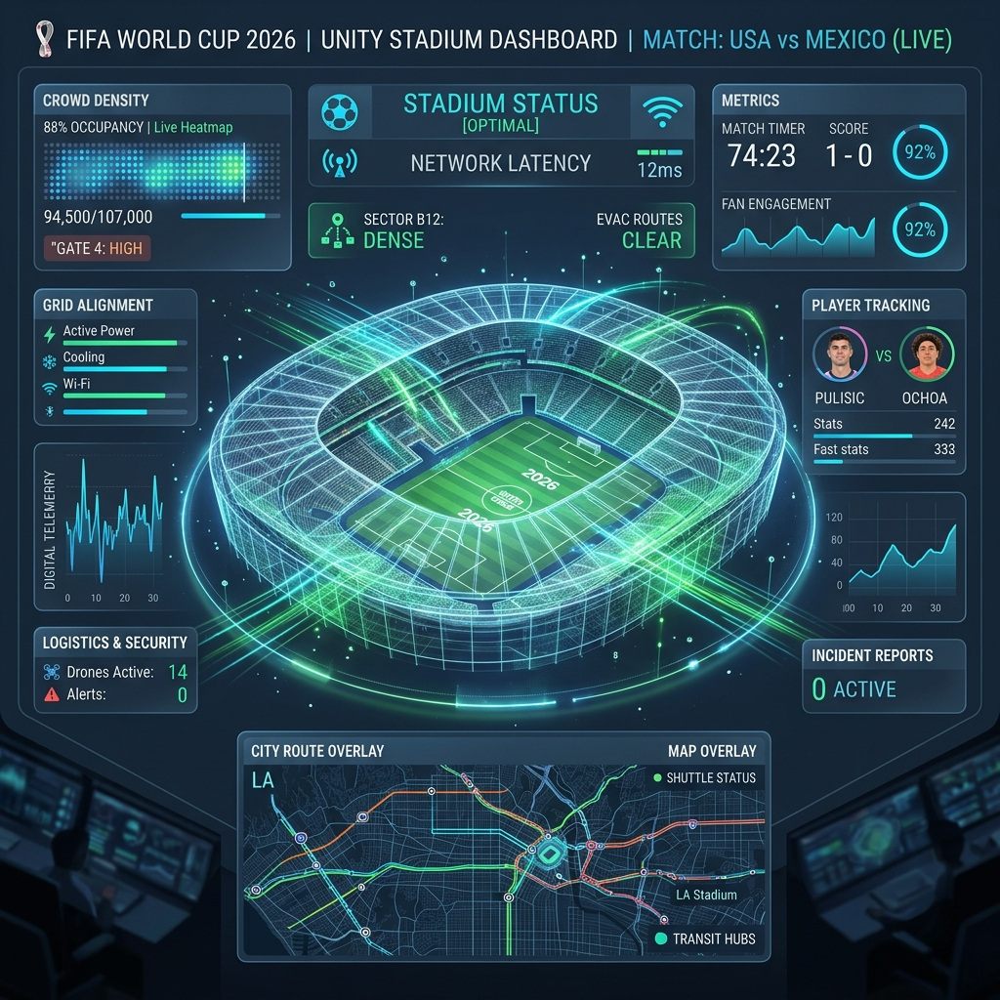
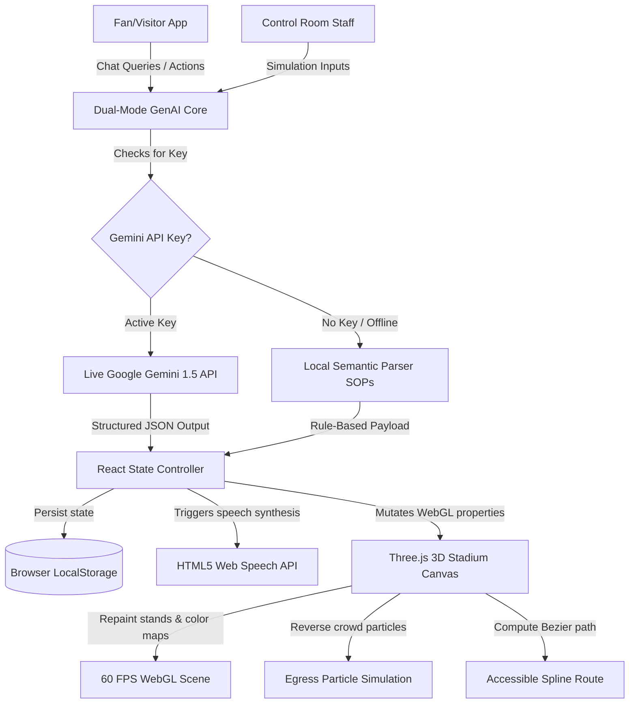

# 🏟️ AuraSphere AI

<div align="center">

**World Cup 2026 // 3D Smart Stadium Operations & Fan Portal**

[](#)
[](#)
[](#)
[](#)
[](#)
[](#)

*An immersive 3D holographic command center and multilingual visitor assistant built to optimize crowd dynamics, accessibility routing, sustainability metrics, and real-time incident dispatches during the FIFA World Cup 2026.*

</div>

---

## 📸 Interface Preview

Here is a mockup of the high-fidelity holographic control panel featuring our live-rendered 3D stadium bowl, dynamic particle streams, and data telemetry panels:

<div align="center">
  
</div>

---

## ⚙️ Core Architecture Flow

AuraSphere AI operates entirely client-side as a high-performance React SPA. Below is the system flow showing how inputs from both Fans and Operators propagate through the GenAI engine to drive rendering actions on the WebGL canvas:



---

## 🛠️ Feature Breakdown

### 🎨 1. Interactive 3D WebGL Arena (`Stadium3D.jsx`)
* **Holographic Bowl**: Programmatically generated dual-tier stands, pitch layouts, and glowing entrance gates.
* **Parent Object Traversal Raycaster**: Resolves click blocking on sub-elements/wireframes, making the entire 3D model fully click-inspectable.
* **Dynamic Hover Telemetry**: A cursor-following tooltip popup displays sector occupancy, concession delay, and bathroom lines on element hover.
* **Wayfinding Paths**: Draws glowing, animated 3D lines tracing the shortest wheelchair-friendly route from entrances to seats.

### 🧠 2. Multilingual Fan Assistant (`FanAssistant.jsx`)
* Floating chat hub providing step-by-step guidance.
* Features quick pills (food, ticket support, train times) in **English, Spanish, and French**.
* Stream responses word-by-word with realistic typewriter animations.

### 🎛️ 3. Operations Control Center (`OpsDashboard.jsx`)
* Real-time sensor panels tracking stadium decibels, clean transit rates, active security incidents, and fluctuating gate entry loads.
* Click stands/gates to inspect details and deploy volunteer squads.

### 🛡️ 4. GenAI Ops Copilot (`OpsCopilot.jsx`)
* A commander terminal that generates action checklists and emergency drill flows.
* **Web Speech Synthesis**: Calls native HTML5 text-to-speech to read broadcast announcements in translated target languages using robotic control-room tones.

### 🌱 5. Gamified Eco-Ledger (`SustainabilityTracker.jsx`)
* Logs green actions (commutes, cup returns, recycling) to claim official FIFA store discount vouchers.

---

## 📋 Operational Drill Scenarios

AuraSphere's interactive systems are designed to respond dynamically to critical events:

| Scenario | Trigger Query | AI Reasoning Trace | 3D Map Vector Response | Spoken Broadcast Action |
| :--- | :--- | :--- | :--- | :--- |
| **Gate Jam** | *"Simulate Gate B Congestion"* | Identifies scan failure rates, loads staff rosters, computes bypass capacities. | Gate B flashes **Red**; draws redirect route to Gate A. | *"Gate B is currently congested. Ticketholders are advised to enter through Gate A..."* |
| **Storm Alert** | *"Rain weather warning"* | Radar fetches storm front timing, checks roof canopy speeds. | Triggers roof motor sequence and overlays warning logs. | *"The stadium roof is closing due to incoming rain. Please stay clear of roof drip-lines."* |
| **Evacuation** | *"Evacuate East Stand"* | Triggers emergency egress paths; disables elevator systems in risk zone. | Stands flash **Red**; crowd particles reverse flow outward. | *"EMERGENCY ANNOUNCEMENT: Please exit the stadium immediately. Walk calmly."* |

---

## 🚀 Deployment Guide

AuraSphere AI compiles as a **static Web App**. 
> [!NOTE]
> There are no external databases (MongoDB) or backend servers (Node/Express) required. Caching is handled in browser `LocalStorage` and Gemini requests are handled client-side.

### ⚡ Vercel Deployment (1-Click)
1. Go to [Vercel](https://vercel.com) and log in with GitHub.
2. Click **Add New** -> **Project**.
3. Import **`ASingh2425/AuraSphere-AI`**.
4. Confirm build settings:
   - **Build Command**: `npm run build`
   - **Output Directory**: `dist`
5. Click **Deploy**. Vercel will host it in under 60 seconds.

### ⚡ Netlify Deployment
1. Log into [Netlify](https://netlify.com).
2. Click **Add new site** -> **Import from Git**.
3. Select `ASingh2425/AuraSphere-AI`.
4. Click **Deploy Site**.

---

## 💻 Local Developer Setup

1. **Clone the repository**:
   ```bash
   git clone https://github.com/ASingh2425/AuraSphere-AI.git
   cd AuraSphere-AI
   ```
2. **Install dependencies**:
   ```bash
   npm install
   ```
3. **Start local dev server**:
   ```bash
   npm run dev
   ```
4. **Build production bundle**:
   ```bash
   npm run build
   ```
